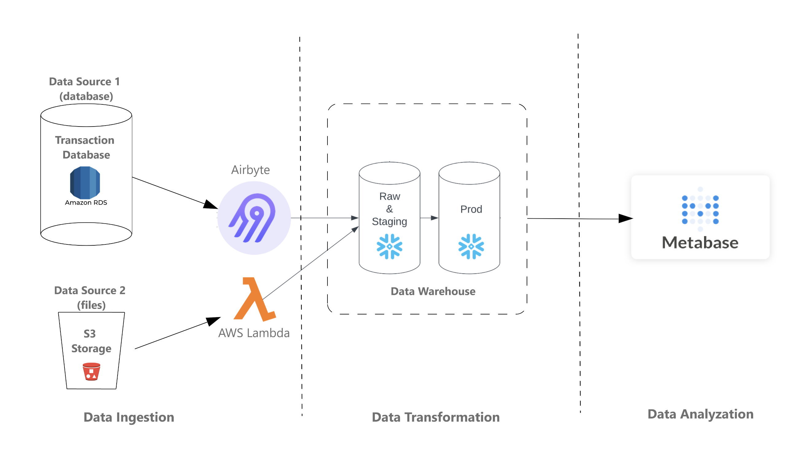
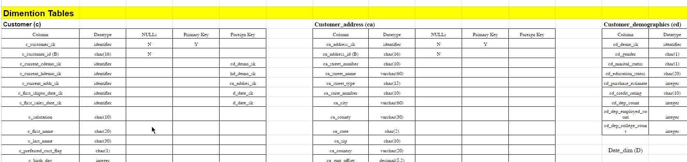
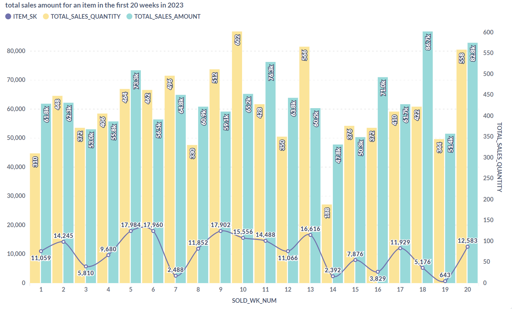
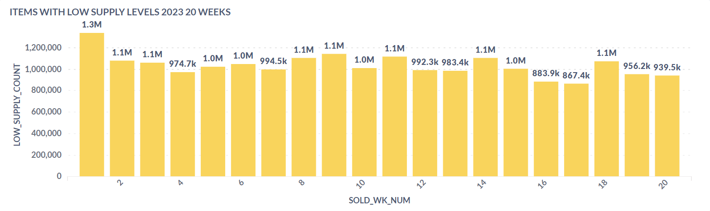
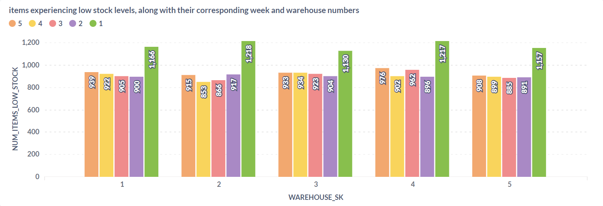

# Data Engineering Project

## Overview

This project demonstrates my data engineering skills by creating a data pipeline that ingests data from multiple sources, processes it, and visualizes the results. The project involves the following components:

- **Airbyte** for data ingestion
- **AWS Lambda** for processing and transferring data
- **Snowflake** for data storage and modeling
- **Metabase** for data visualization

## Project Steps

### 1. Data Ingestion

**Airbyte Setup**

- **Prerequisites:**
  - AWS account
  - Provisioning and terminating an Ubuntu EC2 instance
  - Shell and Docker commands knowledge

- **Steps:**
  - Create a Snowflake database called "TPCDS" and schema called "RAW".
  - Create a table in RAW schema called "inventory", [with the following columns:](diagrams/inventory_table.jpg)
  - Launch two Ubuntu EC2 instances: one for Airbyte and one for Metabase.
  - Install Docker and Docker Compose on both instances.

[Detailed Airbyte Setup Script](scripts/airbyte_setup.sh)

### 2. AWS Lambda Function

- **Purpose:**
  - Download `inventory.csv` from an S3 bucket.
  - Upload the file to Snowflake.
  - Schedule the task to run daily at 2 AM (Riyadh time).

- **Steps:**
  - Create a Lambda function with the required layers. **NOTE: you also can upload create the layers from your local machine instead of cloud shell and upload it manually in the aws interface, but dont forget to pick the proper python version.**
  - Configure the function to download and upload the data.
  - Set up an EventBridge to trigger the function daily.

[Lambda Function Code](scripts/lambda_function.py)

### 3. Airbyte Installation and Configuration

- **Steps:**
  - Install Airbyte on the designated EC2 instance.
  - Configure Airbyte to connect to the Postgres database and Snowflake.
  - Set up the data ingestion pipeline.

[Airbyte Setup Details](docs/documentation.pdf)

### 4. Data Modeling in Snowflake

- **Steps:**
  - Explore the dataset and create a data model.
  - Develop ETL scripts to populate the data model.
  - Schedule tasks and stored procedures for regular data updates.

[Snowflake ETL Script](scripts/snowflake_etl.sql)

### 5. Data Visualization with Metabase

- **Steps:**
  - Install Metabase on the designated EC2 instance.
  - Connect Metabase to the Snowflake database.
  - Create reports based on business requirements.

[Metabase Setup Script](scripts/metabase_setup.sh)

## Architecture 







## Key Strengths Demonstrated

- **Cloud Computing:** Leveraging AWS EC2 and S3 for scalable data ingestion and processing.
- **Data Integration:** Using Airbyte for seamless data ingestion from multiple sources.
- **Serverless Computing:** Implementing AWS Lambda for automated data processing.
- **Data Warehousing:** Utilizing Snowflake for efficient data storage and modeling.
- **Data Visualization:** Creating insightful reports with Metabase.

## Note on Private Data

This repository does not contain any private data. The scripts and documentation provided are for instructional purposes to demonstrate the steps and skills involved in this project.

## Getting Started

1. Clone the repository:
   ```bash
   git clone https://github.com/your-username/analytical-eng.git

2. Follow the setup instructions in the scripts folder to replicate the environment.